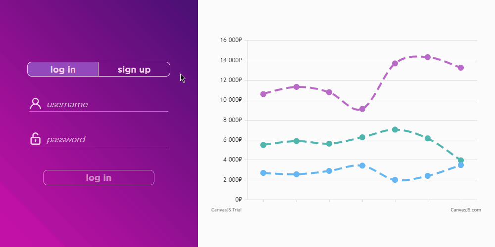
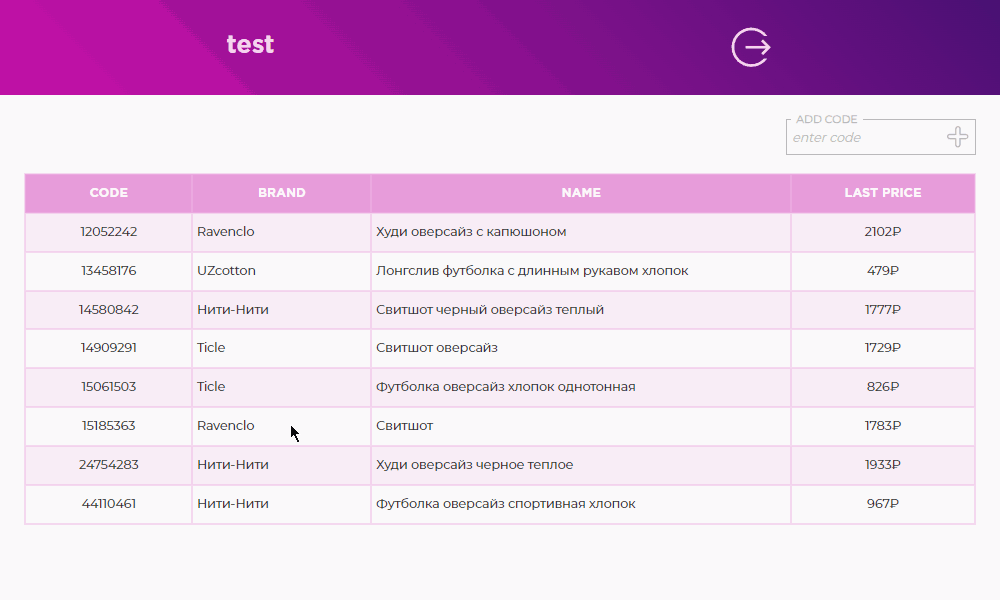
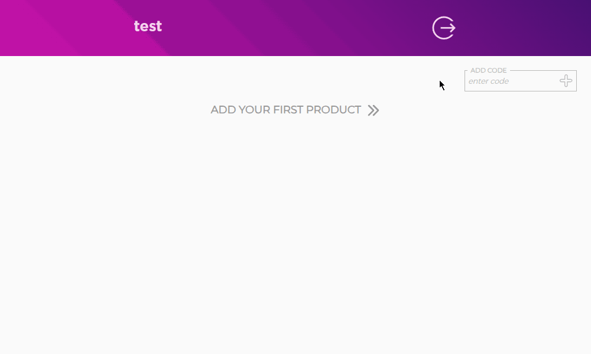
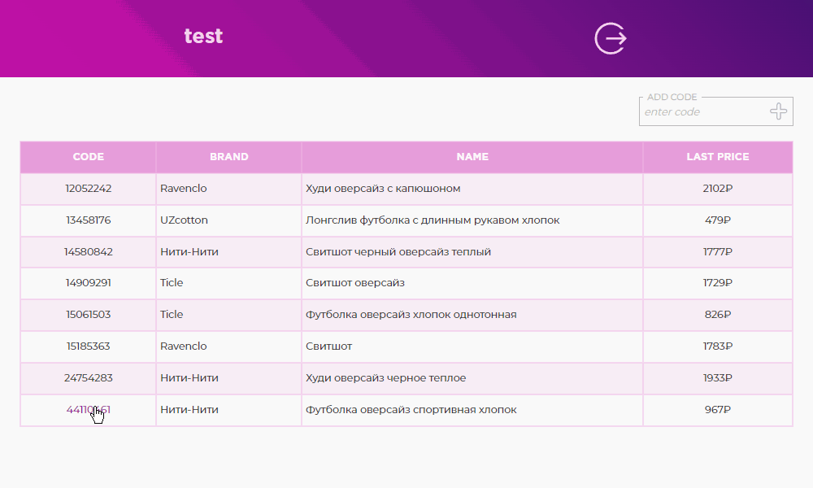

# [](https://www.wildberries.ru/) Wildberries Price Tracker

#### :small_blue_diamond: **Backend using Java with Spring Boot:**

- api communicates with Wildberries interface to retrieve product card information and update product prices and product data on schedule
- authentication and authorization are performed using **Spring Security** and **JWT**
- access to API endpoints using **swagger ui** or **[postman](./wb-price-tracker-api/wb-price-tracker-api.postman_collection.json)**
- database **[migration](./migrations) with liquibase**
- **validation** of request body
- **tests** : JUnit5, Testcontainers

#### :small_blue_diamond: **Frontend using HTML, SCSS, JavaScript with VueJS:**

- navigation using **vue-router**
- **vuex store** as source of State
- **axios** as module for network requests
- validation of forms data using **vuelidate**
- responsive layout adapt to screen size

## :small_blue_diamond: Summary:

- **unauthorized users:** login and registration forms are available with validation of the entered field data. After successful authorization, resources are accessed using a jwt in authorization header <details><summary>_register & login form_</summary>
   </details>

- **authorized users:** in the account you can view and edit the tracked list of products, monitor the price change schedule

  - the price chart displays prices for the last 90 days by default, you can change the display interval in the date search bar <details><summary>_price chart_</summary>
     </details>

  - it is possible to change the list by adding or deleting product by code <details><summary>_add product_</summary>
     </details> <details><summary>_delete product_</summary>
     </details>

## :small_blue_diamond: Docker Compose

Build and run app with [docker compose](./docker-compose.yml) :

```
docker compose up -d
```

Containers:

- api : port - `8085`
- frontend : port - `8088`
- postgres
- liquibase

Once the containers are running successfully, you will be able to access :

- the app by the link : http://localhost:8088

- the backend api using :

  - swagger ui : http://localhost:8085/swagger-ui.html

  - [postman collection](./wb-price-tracker-api/wb-price-tracker-api.postman_collection.json) :
    - `token` - a necessary collection variable for accessing secured endpoints. It is received after successful authorization of the user
    - `wb_code` - variable equal to the code value of product for the certain queries

> the database will be initialized with test [data](./migrations) for the example. Default password used to log in is `Password0`
